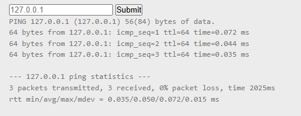
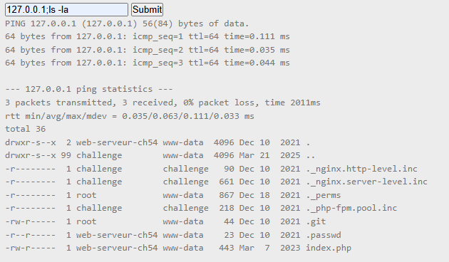
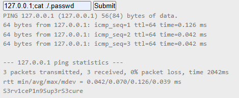

i took a quick look at the challenge, it was all about sending ping requests.

since it takes my input to pass it to the ip variable to send ping request to it, i escaped it using `;`

We were able to list all the files, There's a file called ``.passwd`` it contains the flag.

