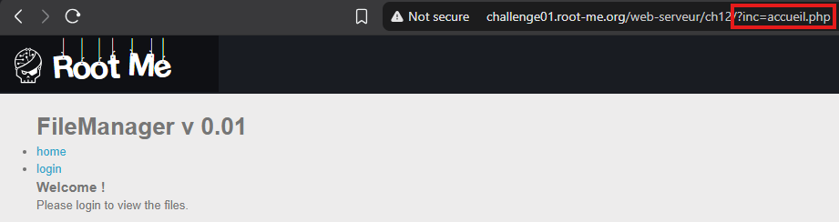
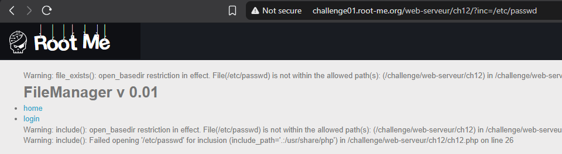
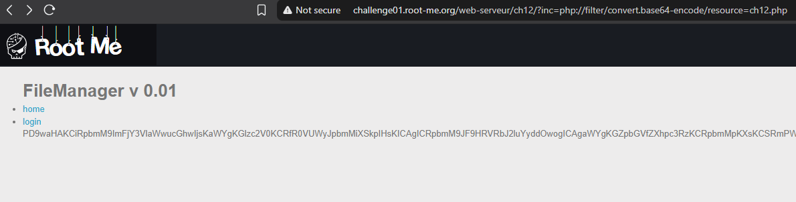
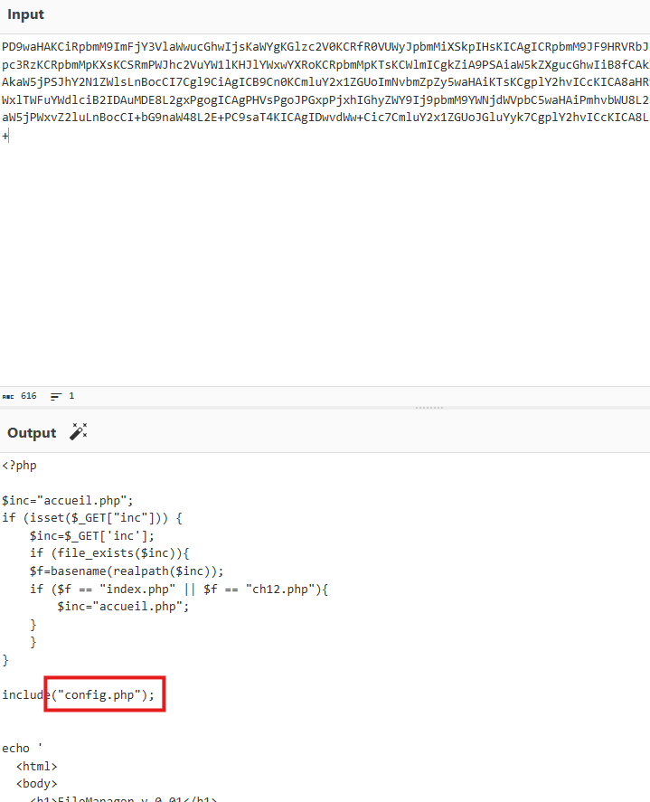
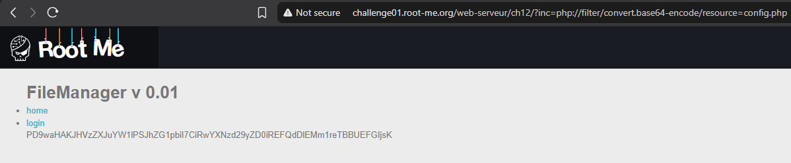
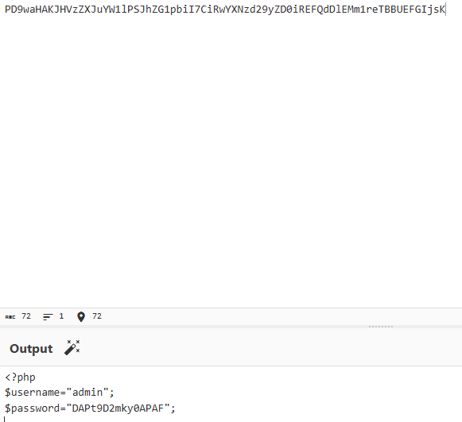

In this challenge i realized there's a parameter that includes these files `home` and `login` 

``http://challenge01.root-me.org/web-serveur/ch12/?inc=accueil.php``

i thought of changing the file into /etc/passwd to see what's gonna happen

i got a php error, since the name of the challenge is giving it away, "PHP Filters".
this resource will help us 

this payload worked for us:
``php://filter/convert.base64-encode/resource=ch12.php``

after decoding it in cyberchef we got another file called "config.php"

Finally we got the user and the password.

