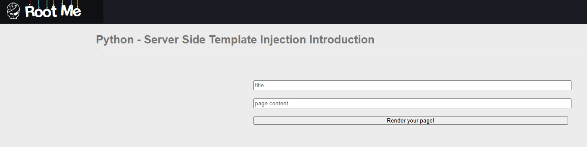
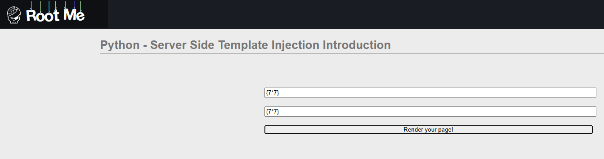
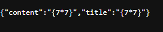
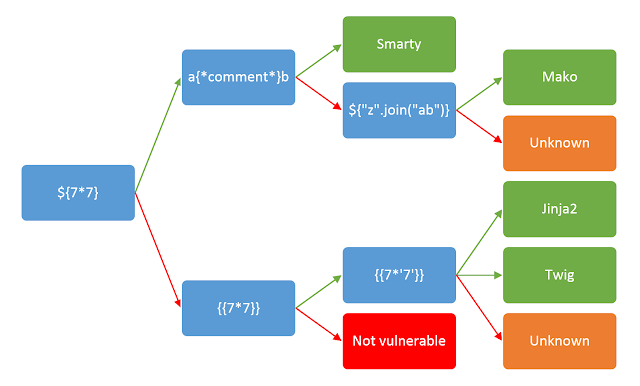
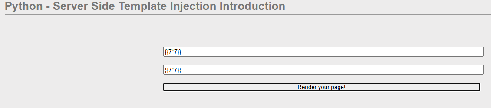
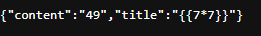
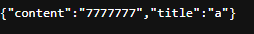
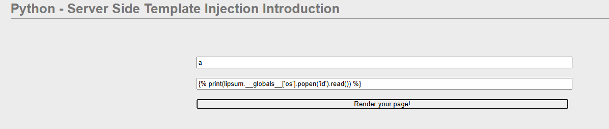
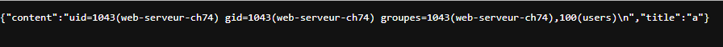
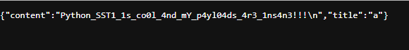

Here we have 2 fields, content and title

we will test if the two numbers were multiplied or not

they were not, there's a picture that could help us if they were multiplied and what to do

we will try again with different payload

it worked!

since it's jinja we will refer to [hacktrickz](https://hacktricks.wiki/en/pentesting-web/ssti-server-side-template-injection/jinja2-ssti.html) for the payloads

Finally, we were able to list all the files and retrieve the flag.

