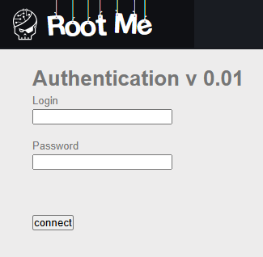
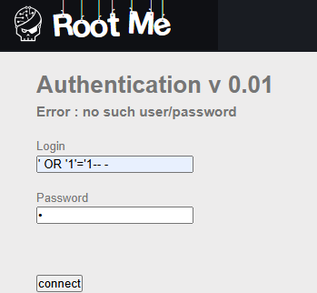
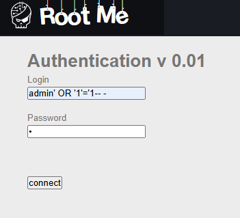
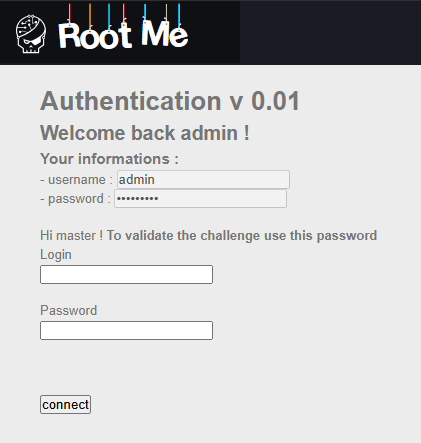
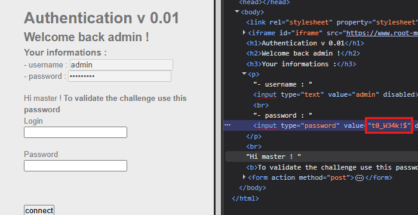

The name it self, SQLi in login page

here we have a login page, so i tried one of the most if not the most famous payload in the world
`' OR '1'='1-- -`

but unfortunately it didn't work because the user was blank, so i said it might check the user then do the condition
in this case i used admin

it worked!

Now we are gonna reveal the password using inspect :)

