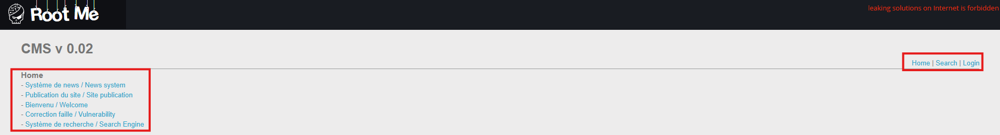
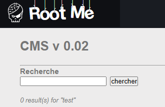
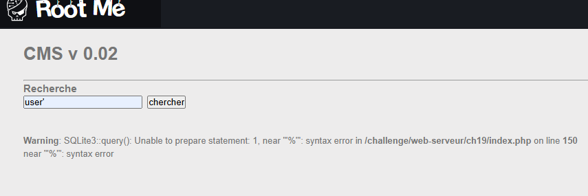
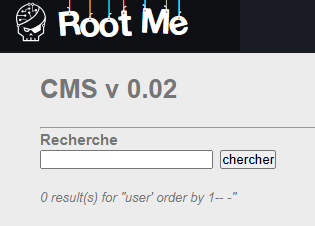
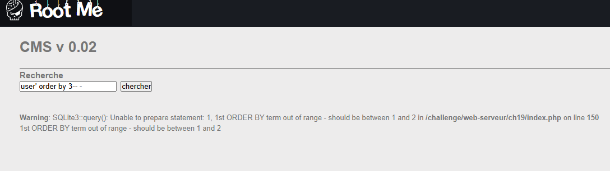
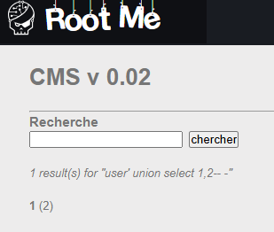

We have many options here

i tried on the news section and the login page but it didn't worked, but the search bar only.

i tried to trigger the error and finally got it

one thing i realized we are dealing with `SQLite`, so we know what to [do](https://github.com/swisskyrepo/PayloadsAllTheThings/blob/master/SQL%20Injection/SQLite%20Injection.md) :)

i tried to find out how many columns using `order by`

it turned out to be only two.

Now we are gonna extract the database structure but we are not sure which one to use either `sqlite_schema` or `sqlite_master` one way to find out is to look for the version.

